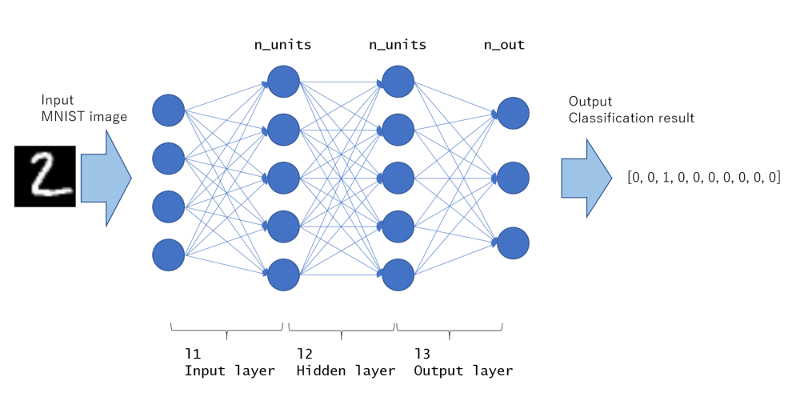
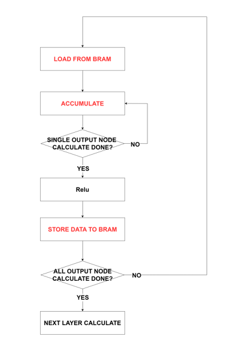
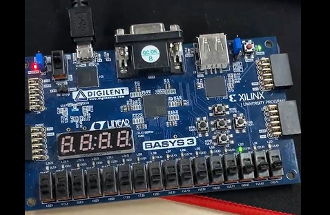

# FPGA-Based MNIST Digit Classification System

## Overview
This project implements a fully pipelined neural network for MNIST handwritten digit classification 
on a BASYS-3 FPGA. It uses a three-layer fully connected architecture with quantized weights 
and activations to achieve efficient hardware implementation.

## Features

### Neural Network Architecture
- Input Layer: Processes 28×28 grayscale images (784 pixels)
- Hidden Layer 1: 784→60 neurons with ReLU activation and 4-MAC parallel processing
- Hidden Layer 2: 60→30 neurons with ReLU activation and single-core MAC
- Output Layer: 30→10 neurons with argmax classification

### Hardware Implementation
- Memory: Uses on-chip BRAM for storing weights
- Quantization: 8-bit quantized format for weights and inputs
- Processing: Combination of parallel and sequential MAC units
- Pipelining: Layer-by-layer execution with handshaking signals

## Block Diagram

## Dependencies

### Hardware
- BASYS-3 FPGA Board (or compatible Xilinx FPGA)

### Tools
- Vivado 2020.2 (or compatible version)

### Custom Modules
- single_port_bram_*: Single-port BRAM implementations
- dual_port_bram_*: Dual-port BRAM implementations
- fully_connected_layer_4_CORE_PARALLEL_RELU: 4-MAC parallel FCN with ReLU
- fully_connected_layer_SINGLE_CORE_RELU: Single-core FCN with ReLU
- fully_connected_layer_SINGLE_CORE_ARGMAX: Single-core FCN with argmax output

## Getting Started
### HOW TO START?
1. Use `01.MNIST_TRAIN.py` to train the model and obtain quantized weights
2. Verify model accuracy with real images using `02.MNIST_INFERENCE.py`
3. Convert weights to memory file format with `03.txt_to_mem.py`
4. Convert 28x28 input images to memory file format with `04.picture_to_mem.py`
5. Load input images and layer weights into BRAM and generate bitstream

Input images can be downloaded from: https://github.com/teavanist/MNIST-JPG

### Processing Flow
1. The system activates upon receiving an `i_run` trigger
2. Layer 1 processes input image data (784 elements)
3. When Layer 1 completes, it triggers Layer 2 processing
4. Layer 2 completion triggers the Output Layer
5. The Output Layer performs argmax to determine the final digit classification
6. Result is available in the `mnist_class` output (LED)

